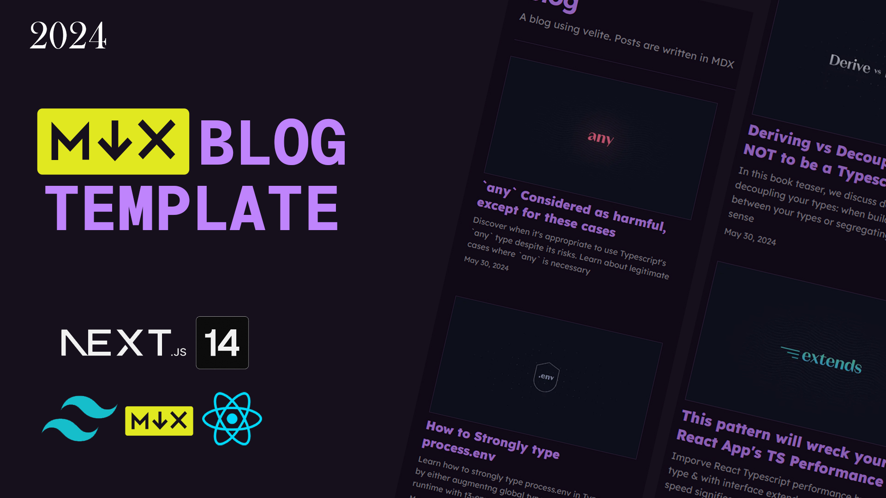

# Austin's MDX Blog

A personal blog by Austin Xu built with MDX, Next.js 14, and modern web technologies. Share thoughts, tutorials, and insights about web development.



## Table of Contents

- [Features](#features)
- [Used Technologies](#used-technologies)
- [Run Locally](#run-locally)
- [Adding Content](#adding-content)

## Features

- 📝 **MDX Components** - Write blog posts in MDX with custom React components
- 📱 **Responsive Design** - Built using `shadcn/ui` and `tailwindcss`
- 🎨 **Syntax Highlighting** - Beautiful code blocks with syntax highlighting
- ⚡ **Fast Performance** - Static site generation with Next.js
- 🔍 **SEO Optimized** - Meta tags and structured data
- 🌙 **Clean Design** - Minimalist and readable layout

## Used Technologies

- **Next.js 14**: Leveraging static site generation (SSG) for optimal performance and SEO
- **MDX**: Write blog posts in Markdown with embedded React components
- **Tailwind CSS**: Utility-first CSS framework for rapid UI development
- **shadcn/ui**: Beautiful, accessible, and customizable UI components
- **Velite**: Type-safe data layer for transforming Markdown/MDX files
- **TypeScript**: Full type safety throughout the application

## Run Locally

Get Austin's blog running on your local machine:

1. **Clone the repository**:

   ```bash
   git clone https://github.com/ShenghaoisYummy/next-mdx-blog.git
   ```

   Navigate to the project directory:

   ```bash
   cd next-mdx-blog
   ```

2. **Install Dependencies**:

   Install the required dependencies using npm:

   ```bash
   npm install
   ```

   Or using pnpm:

   ```bash
   pnpm install
   ```

3. **Run the Development Server**:

   Start the development server:

   ```bash
   npm run dev
   ```

   Open [http://localhost:3000](http://localhost:3000) in your browser

4. **Build for Production**:

   Create an optimized production build:

   ```bash
   npm run build
   ```

## Adding Content

To add new blog posts:

1. Navigate to the `src/content/blog/` directory
2. Create a new `.mdx` file with the following frontmatter:

   ```mdx
   ---
   title: "Your Blog Post Title"
   description: "A brief description of your post"
   image: "/images/blog/your-image.jpg"
   date: "2024-01-01"
   author: "Austin Xu"
   published: true
   ---

   Your blog content goes here...
   ```

3. **Important**: Use kebab-case for filenames (e.g., `my-awesome-blog-post.mdx`)

## Author

Built with ❤️ by [Austin Xu](https://github.com/ShenghaoisYummy)

---

Feel free to fork, star ⭐, or contribute to this project!
